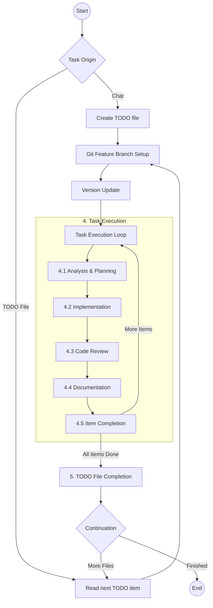

# Base Project for AI Agent Driven Development

This project serves as a foundational template for future AI-agent driven development. It is pre-configured with essential rules, workflows, and structures optimized for collaboration between human developers and AI agents (specifically Kilo Code).

**Attention AI Agents:** Before making any changes, you **must** read and adhere to the guidelines outlined in [`AGENTS.md`](AGENTS.md:1). This file contains critical information about the project's workflow, rules, and architectural standards.

## About this Project

The primary goal of this repository is to provide a clean, structured starting point for new projects with built-in "AI-Readiness."

### Core Requirements

- **Foundation**: A structured baseline for new repositories.
- **AI-Readiness**: Integrated configurations to enable immediate and effective AI agent participation.
- **Standardization**: Established coding standards, workflows, and documentation practices.
- **Memory Bank**: A persistent context and knowledge management system for agents.

## Project Structure

Understanding the purpose of the configuration directories is key to effective development:

- [`.ai-agent/`](.ai-agent/): Stores project-specific agent context. Includes the [`.ai-agent/todos/`](.ai-agent/todos/) directory for task tracking, local rules, and the [`project-structure.md`](.ai-agent/project-structure.md:1) map.
- [`.kilocode/`](.kilocode/): The operational core of the AI integration. Contains global [`.kilocode/rules/`](.kilocode/rules/), standardized [`.kilocode/workflows/`](.kilocode/workflows/), and the [`.kilocode/_generated/plans/`](.kilocode/_generated/plans/) directory where agents store detailed implementation plans.

## The Critical Workflow

The project follows a standardized process for task execution, ensuring systematic progress from analysis to deployment.



For full details, see [`critical-workflow.md`](.kilocode/workflows/critical-workflow.md:1).

## How to Start a Task

To initiate work with an AI agent, use one of the following copy-paste friendly commands in the chat.

### Option 1: Using a TODO File (Recommended)

1. Create a new file named `YYYYMMDD-todo-X.md` in [`.ai-agent/todos/`](.ai-agent/todos/).
2. Paste the following into the chat:

```text
follow @/.kilocode/workflows/critical-workflow.md and full read @/AGENTS.md
do: @/.ai-agent/todos/<YYYYMMDD>/<YYYYMMDD>-todo-<number>.md
```

### Option 2: Direct Chat Request

If you have a quick request, use this template:

```text
follow @/.kilocode/workflows/critical-workflow.md and full read @/AGENTS.md
do: [Your specific task or request here]
```

## Prerequisites

- **Kilo Code**: Optimized for the Kilo Code plugin for VSCode.
- **Memory Bank**: Utilizes the Memory Bank feature of Kilo Code for persistent context. Read the Kilo Code documentation at its official page.
- **Git**: Ensure your environment is configured for the workflow. See [`how-to-set-up-git.md`](docs/how-to-set-up-git.md:1).

---

*Note: This workflow is actively maintained and updated to improve stability and introduce new features.*
